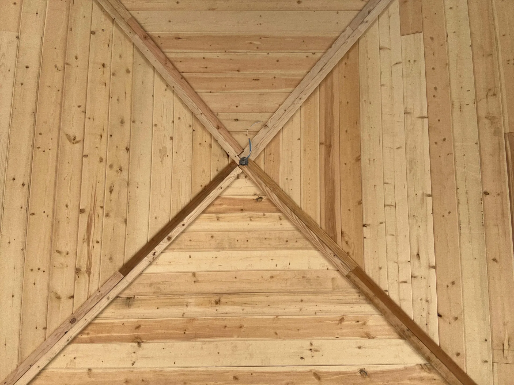

## Overview

We designed and framed a freestanding gazebo over an existing pool patio. The pyramid roof was framed with dimensional lumber radiating to a center point, then finished underneath with a clean tongue-and-groove wood ceiling.

### What we did
- Set posts and beams sized for the Arizona wind and sun exposure
- Framed a four-hip pyramid roof converging to a center hub
- Finished the underside in tongue-and-groove planking for a warm, seamless ceiling
- Roughed in electrical for a center light fixture

