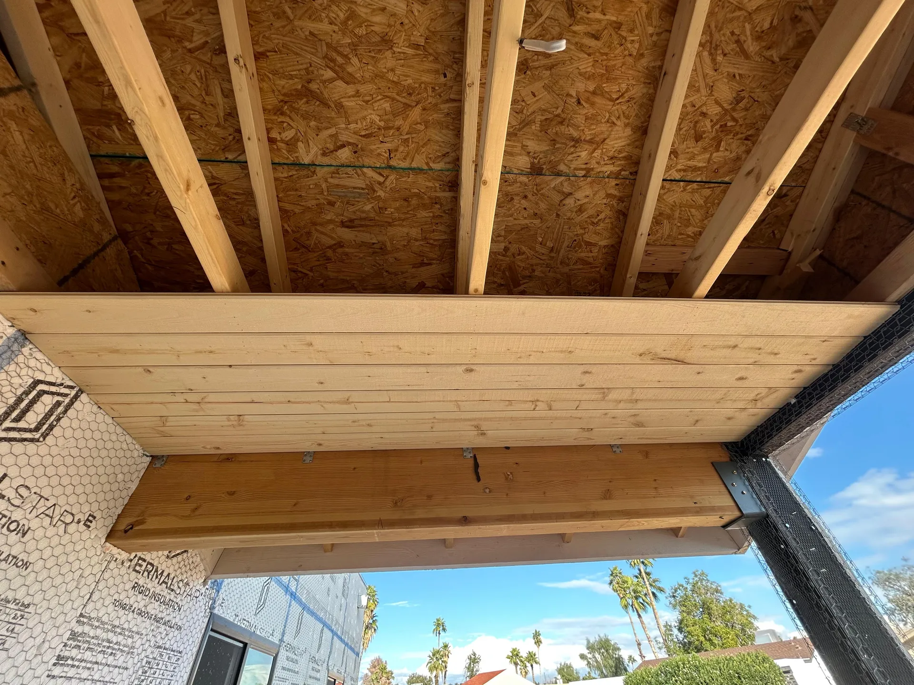
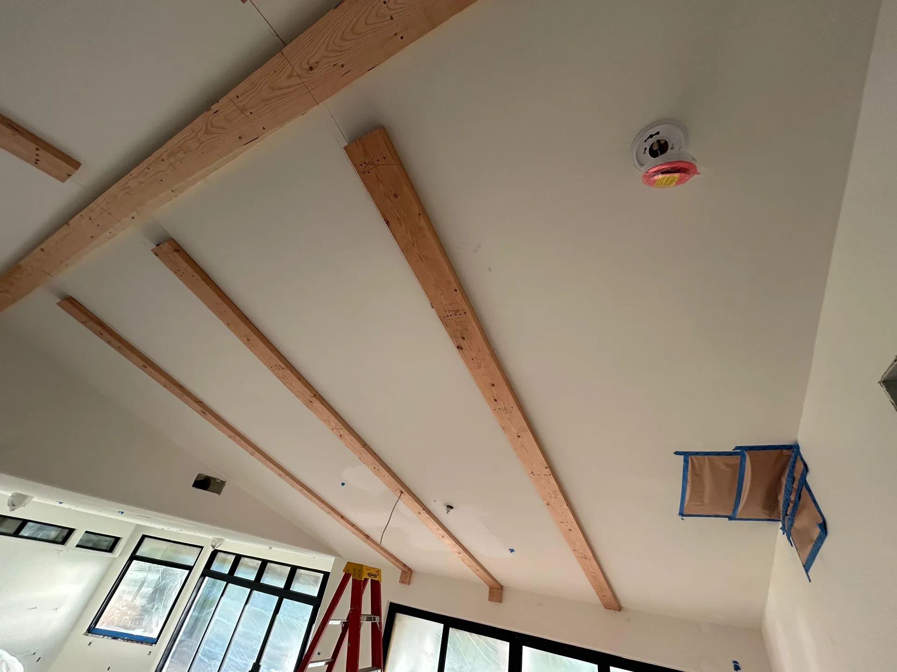

## Overview

For this interior remodel we opened up a vaulted great room and dressed the ceiling with exposed beams and warm wood planking, turning a plain space into the centerpiece of the home.

### What we did
- Installed exposed structural beams along the vault
- Clad the full ceiling in tongue-and-groove planking
- Fit the work cleanly around arched windows and existing walls

