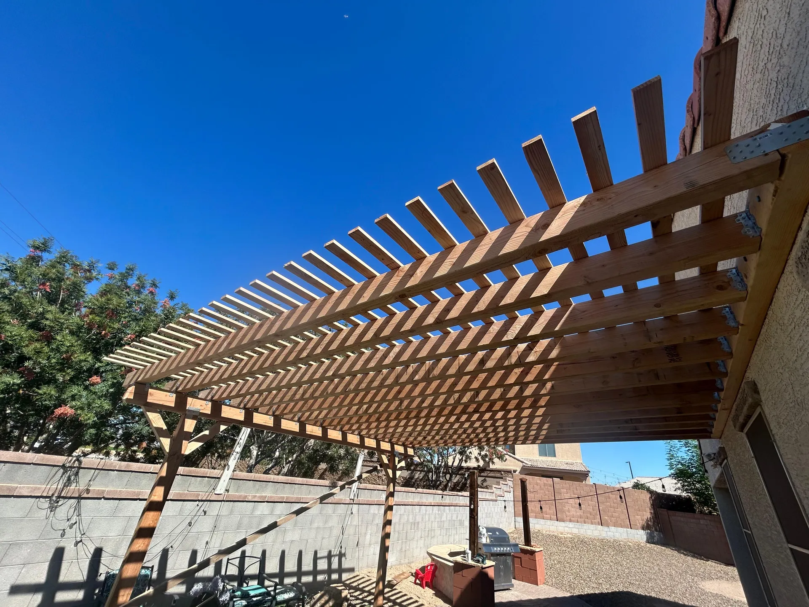

## Overview

We built a large attached pergola to turn an exposed backyard into a usable, shaded living space. The rafters and lattice were laid out to cut the harsh afternoon sun while keeping an open, airy feel.

### What we did
- Anchored posts and a ledger to the house for a solid attached structure
- Framed evenly spaced rafters with a cross-lattice top
- Sized and oriented the slats for effective shade in the Phoenix climate

