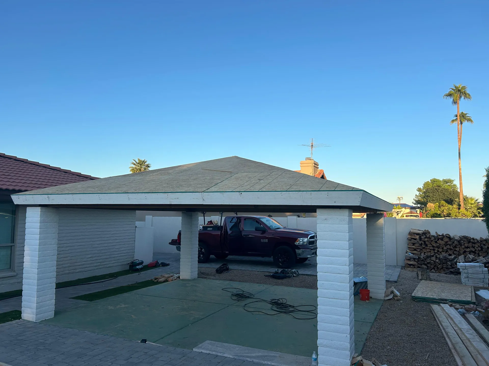

## Overview

This ramada pairs sturdy painted masonry columns with a wood-framed roof, giving a permanent, low-maintenance patio cover that stands up to the desert climate.

### What we did
- Tied the wood structure into solid masonry columns
- Framed the roof with exposed beams for a clean finished underside
- Detailed the connections for strength and a tidy appearance

