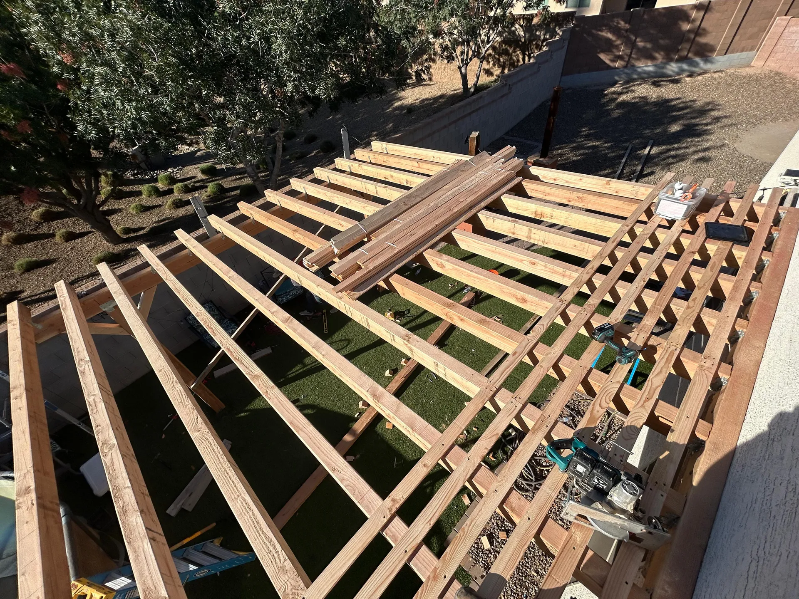

## Overview

We ran an attached lattice cover along the back of the house to shade the windows and patio without closing off the space. The even spacing keeps light and air moving while cutting direct sun.

### What we did
- Attached a ledger and framed rafters along the wall line
- Installed a uniform cross-lattice top for filtered shade
- Kept clean sightlines over the windows and doors

