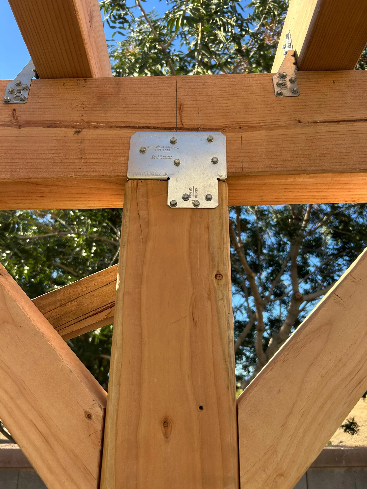

## Overview

Good structures live or die at the connections. On every project we cut tight joints and reinforce the load points with galvanized structural hardware, so the work is as sound as it is clean.

### What we did
- Cut and fit beam-to-post joints for full bearing
- Reinforced connections with galvanized structural ties
- Detailed posts and beams for both strength and appearance

